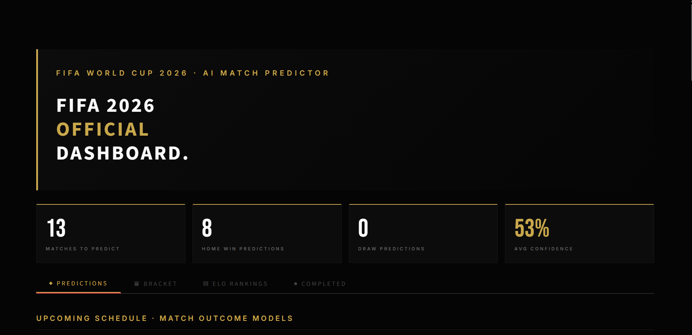
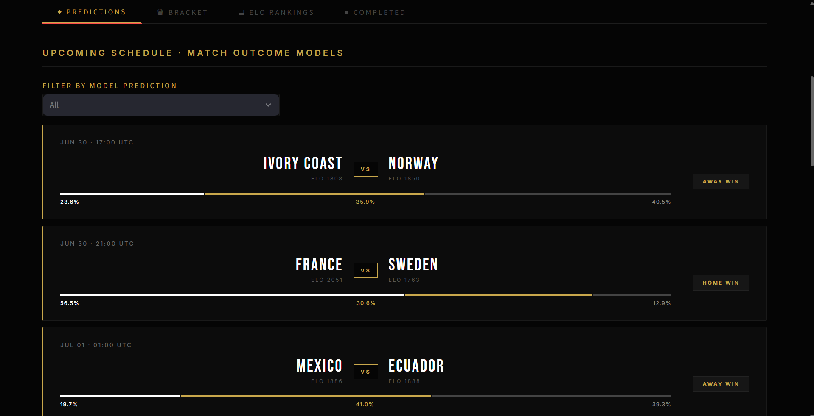
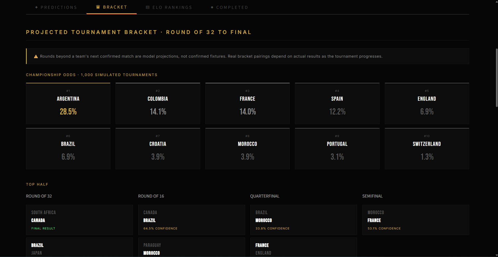
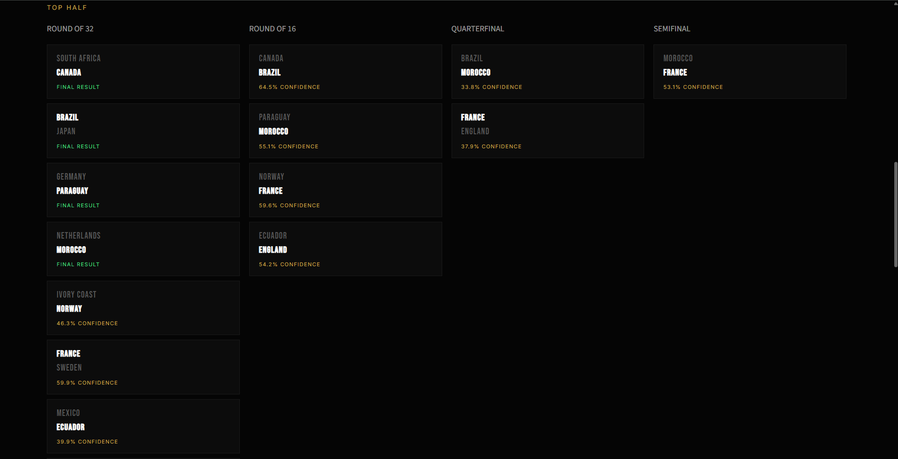
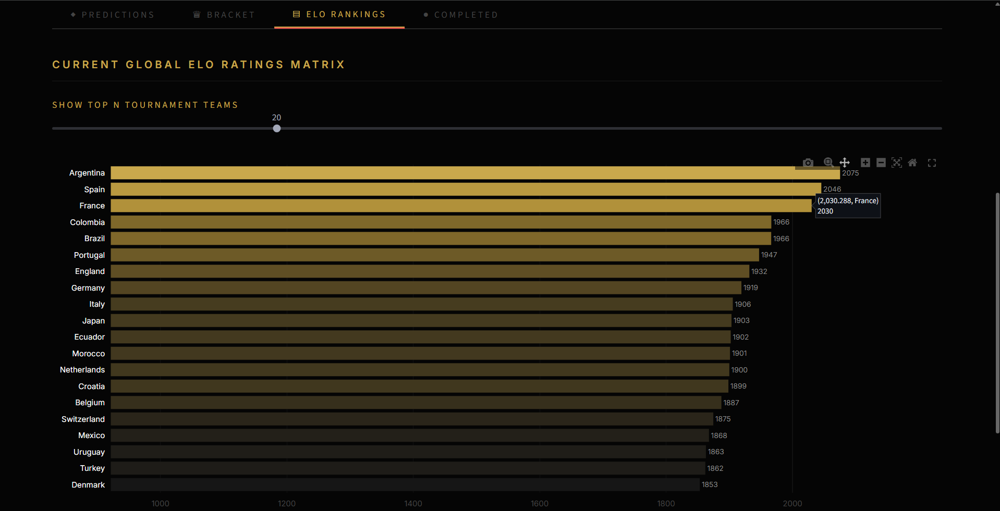
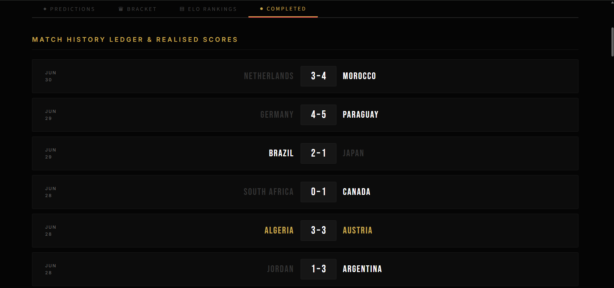

# 🏆 FIFA World Cup 2026 — Live Match Predictor

A live, self-updating machine learning system that predicts FIFA World Cup 2026 match outcomes in real time — built and deployed *during* the tournament itself.

The model combines a custom ELO rating engine, recent-form features, and head-to-head history to power an XGBoost classifier, then runs Monte Carlo tournament simulations to project championship odds for every remaining team. Predictions are not just for individual matches — the system simulates the full knockout bracket all the way to a projected champion.



---

## What it does

- **Predicts every remaining World Cup match** using a model trained on 25,000+ international matches since 2000
- **Updates automatically** as real results come in — one command refreshes fixtures, ELO ratings, and predictions
- **Projects the full knockout bracket**, Round of 32 through to the Final, using the model's own predictions for matchups that haven't happened yet
- **Calculates championship odds** for every team via 1,000 simulated tournament runs (Monte Carlo simulation), not just a single deterministic path
- **Visualizes everything** in a custom-built Streamlit dashboard styled after official FIFA tournament branding

---

## Live Demo

🔗 **[fifa-wc2026-predictor123.streamlit.app](https://fifa-wc2026-predictor123.streamlit.app)**

---

## Dashboard Preview

### Match Predictions
Live win/draw/loss probabilities for every upcoming match, with ELO ratings and confidence bars.



### Championship Odds
Monte Carlo–simulated championship probabilities across 1,000 full tournament runs.



### Tournament Bracket
The model's projected path through the knockout stage, including confidence scores for each matchup.



### ELO Power Rankings
Live-updating team strength ratings, recalculated after every match.



### Match History
A running ledger of completed tournament results.



---

## How it works

### 1. Data
- **Historical data:** [Kaggle international football results dataset](https://www.kaggle.com/datasets/martj42/international-football-results-from-1872-to-2017) — 49,000+ matches since 1872, filtered to 2000+ for training to reflect the modern era of football
- **Live tournament data:** [football-data.org](https://www.football-data.org) API — fixtures, live results, and match status for WC2026

### 2. ELO Rating System
A custom ELO implementation (built from scratch, not a library) calculates a live strength rating for every national team, starting at 1500 and updating after every match based on result and opponent strength. Ratings are recalculated to include WC2026 results as they happen.

### 3. Feature Engineering
Each match is converted into a feature vector:
- `elo_diff` — ELO gap between the two teams
- `home_form` / `away_form` — win rate over each team's last 10 matches
- `h2h` — historical head-to-head win rate between the two teams
- `neutral` — whether the match is played on neutral ground

### 4. Model
An **XGBoost classifier** predicts Win / Draw / Loss, trained with class-weighting to correct for the natural rarity of draws in the dataset. Since World Cup knockout matches cannot end in a draw, draw predictions are automatically reassigned to whichever team has higher win probability for any knockout-stage fixture.

**Accuracy: 55.2%** on held-out test data — in line with professional football prediction benchmarks, where football's inherent unpredictability caps most models in the 55–65% range.

### 5. Bracket Simulation
- **Deterministic bracket** (`bracket.py`): walks the actual tournament structure once, always advancing the model's top pick, to show one concrete projected path to the final
- **Monte Carlo simulation** (`simulate_odds.py`): runs the entire bracket 1,000 times, sampling outcomes probabilistically from the model's predicted win percentages each time, then aggregates how often each team wins it all — producing genuine championship odds rather than a single guess

### 6. Live Updates
Running `update.py` re-fetches the latest results and regenerates every prediction, ELO rating, and bracket projection in one step — designed to be re-run after each day's matches during the tournament.

---

## Tech Stack

| Layer | Tool |
|---|---|
| Language | Python 3.13 |
| Data processing | pandas, numpy |
| Model | XGBoost |
| Tournament simulation | Custom Monte Carlo engine |
| Dashboard | Streamlit, Plotly |
| Live data | football-data.org API |
| Historical data | Kaggle |

---

## Project Structure

```
fifa-wc2026-predictor/
├── data/
│   ├── results.csv              # historical matches (1872–2024)
│   ├── wc2026_all.csv           # full WC2026 fixture list
│   ├── wc2026_completed.csv     # finished WC2026 matches
│   ├── wc2026_remaining.csv     # upcoming WC2026 matches
│   ├── elo_ratings.csv          # current ELO ratings, all teams
│   ├── features.csv             # engineered training features
│   ├── predictions.csv          # model predictions, remaining matches
│   ├── bracket.json             # deterministic bracket projection
│   └── championship_odds.json   # Monte Carlo championship odds
├── models/
│   └── xgb_model.pkl            # trained XGBoost model
├── src/
│   ├── fetch_data.py            # pulls live WC2026 data from API
│   ├── elo.py                   # ELO rating engine
│   ├── features.py              # feature engineering pipeline
│   ├── model.py                 # model training
│   ├── predict.py               # generates match predictions
│   ├── bracket.py                # deterministic bracket simulation
│   ├── simulate_odds.py         # Monte Carlo championship odds
│   └── update.py                # one-command full pipeline refresh
├── app.py                       # Streamlit dashboard
└── requirements.txt
```

---

## Running it locally

```bash
# clone the repo
git clone https://github.com/elentajacob/FIFA-wc2026-predictor.git
cd FIFA-wc2026-predictor

# install dependencies
pip install -r requirements.txt

# add your football-data.org API key to a .env file
echo "FOOTBALL_API_KEY=your_key_here" > .env

# run the full pipeline
python src/fetch_data.py
python src/elo.py
python src/features.py
python src/model.py
python src/predict.py
python src/bracket.py
python src/simulate_odds.py

# launch the dashboard
streamlit run app.py
```

To refresh predictions after new matches finish:

```bash
python src/update.py
```

---

## What I learned

- Building an ELO rating system from first principles, rather than using a library, to understand exactly how relative team strength should update after a result
- The difference between a single deterministic prediction and a true probabilistic simulation — Monte Carlo bracket simulation surfaces championship odds that a one-shot bracket walk completely hides
- Handling real messy live API data: timezone mismatches, inconsistent status fields, and incomplete future fixtures that depend on still-undetermined matchups
- Correcting for class imbalance (draws are rarer than wins) without simply suppressing a class entirely
- Domain-specific post-processing matters: a generic 3-class model needed an explicit rule for knockout matches, since football's structure (no draws once it's win-or-go-home) isn't something the model can learn from historical data alone

---

## Disclaimer

This is a personal portfolio project built for educational purposes. Predictions are model-generated estimates based on historical and live data, not betting advice. Round of 32 results were correctly anticipated in several cases (e.g. Morocco over Netherlands), but football is inherently unpredictable — that's most of the fun.

---

Built by [Elenta Jacob](https://github.com/elentajacob) · [LinkedIn](https://linkedin.com/in/elentajacob)